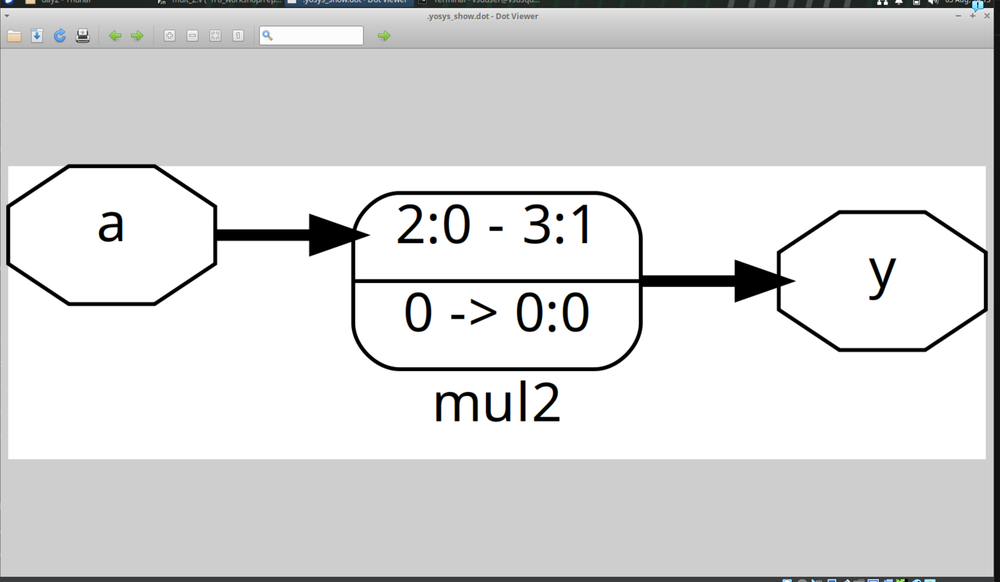
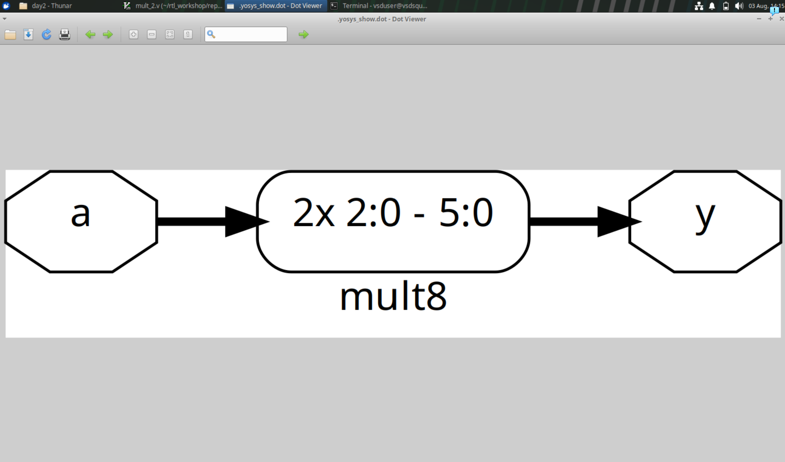
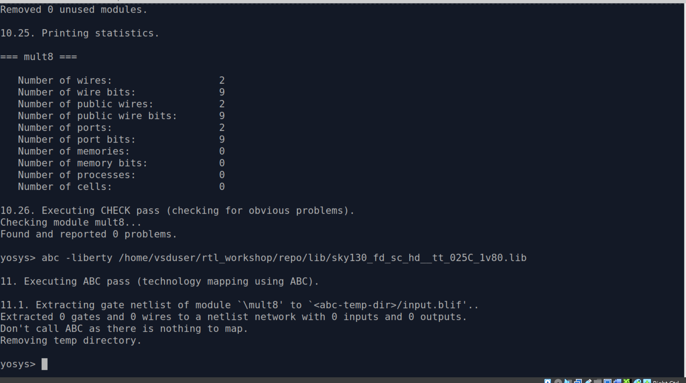

## Interesting optimizations in hardware

Multiplication (and division) by 2 or a non-negative power of 2 leads to left (or right) shift. Such shifts are just rewiring circuits and don't require any cells, hence 'abc' command gives an error.

Circuit for multiplication by 2

Circuit for multiplication by 8

'abc' error and 'synth' statistics that prove no cells are used
