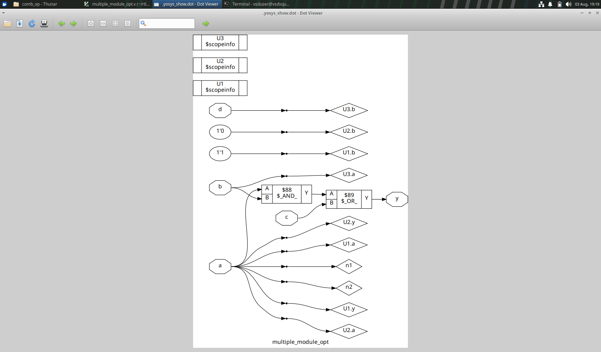

## Synthesis of multiple module verilog file

If the module is not flattened, the final circuit is not the most optimized. The unused logic is removed but boolean optimization is not done.

The file multmodoptv2.v is the same as multiple_module_opt.v, except the submodules are removed and logic is directly defined within one module.
The synthesis of this can follow the normal procedure, and it still gives the most optimized circuit.

The code below is synthesized using synth -flatten command, its expected and actual circutis are as show at different points of synthesis flow.

```
module sub_module1(input a , input b , output y);
 assign y = a & b;
endmodule


module sub_module2(input a , input b , output y);
 assign y = a^b;
endmodule


module multiple_module_opt(input a , input b , input c , input d , output y);
wire n1,n2,n3;

sub_module1 U1 (.a(a) , .b(1'b1) , .y(n1));
sub_module2 U2 (.a(n1), .b(1'b0) , .y(n2));
sub_module2 U3 (.a(b), .b(d) , .y(n3));

assign y = c | (b & n1); 
endmodule
```


expected circuit


after synth -flatten but before 'abc' command


after 'abc' command


after 'opt_clean -purge' command


