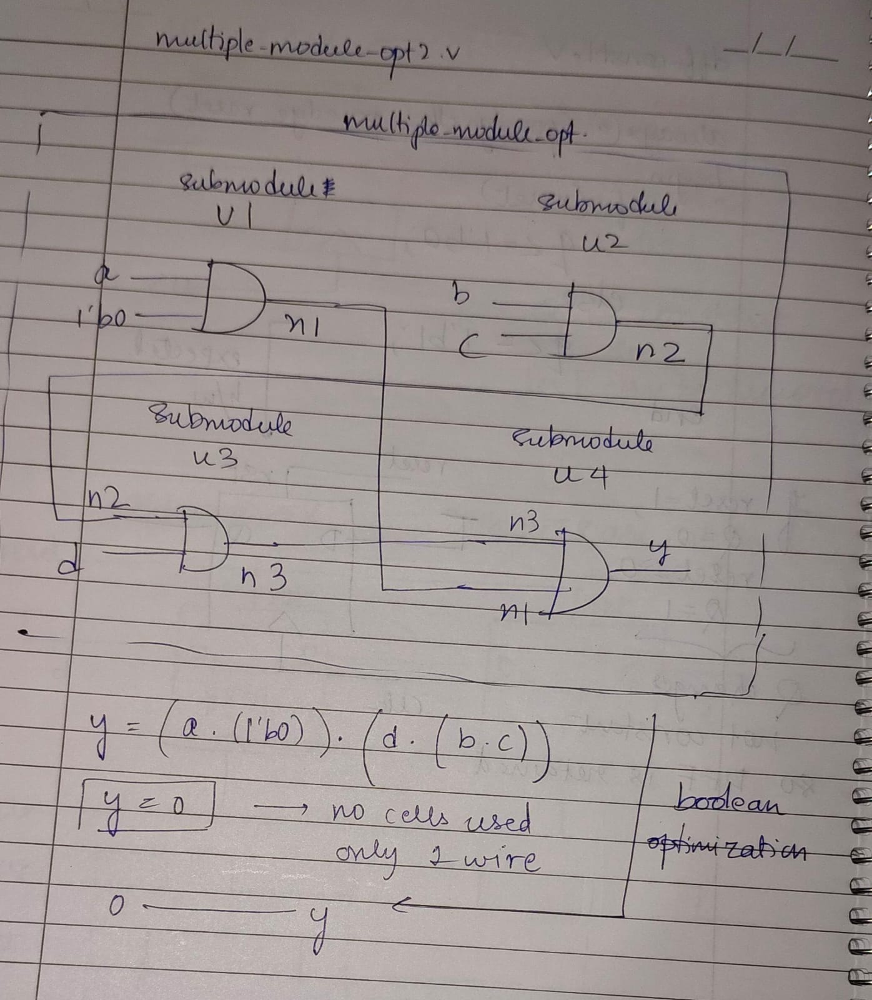
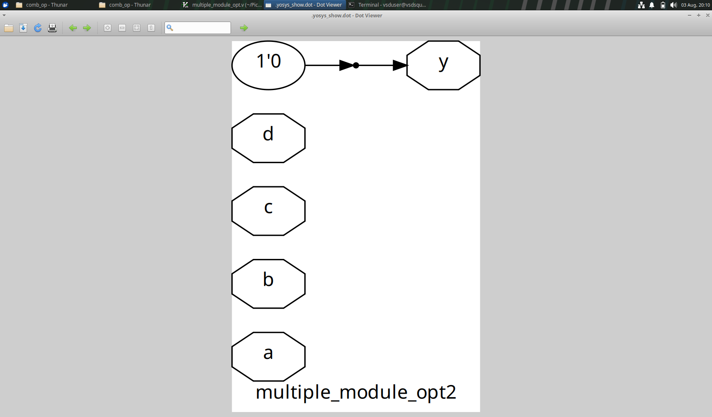

## Mulimodule synthesis and its optimization

The code below is synthesized:

```
module sub_module(input a , input b , output y);
 assign y = a & b;
endmodule


module multiple_module_opt2(input a , input b , input c , input d , output y);
wire n1,n2,n3;

sub_module U1 (.a(a) , .b(1'b0) , .y(n1));
sub_module U2 (.a(b), .b(c) , .y(n2));
sub_module U3 (.a(n2), .b(d) , .y(n3));
sub_module U4 (.a(n3), .b(n1) , .y(y));
endmodule
```

The expected and actual circuits are as follows:


Expected circuit


Circuit after flattening, synthesis, mapping ('abc' command) and optclean command


The 'abc' command error proves that no cells are used in the circuit, so nothing to map
