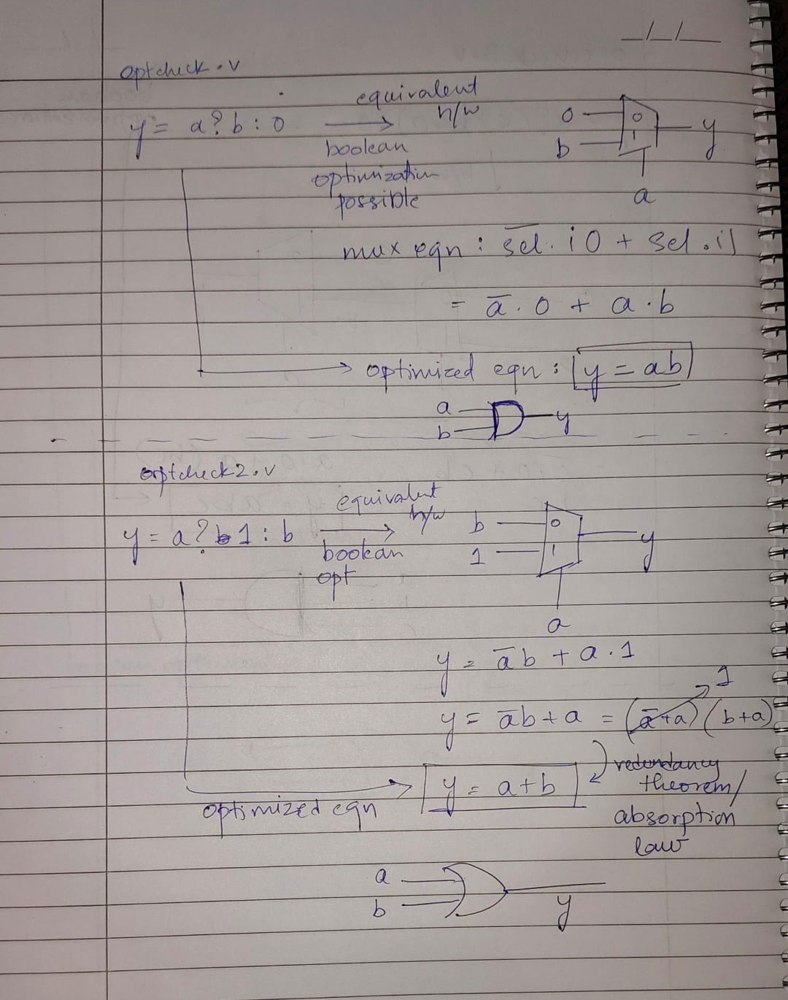
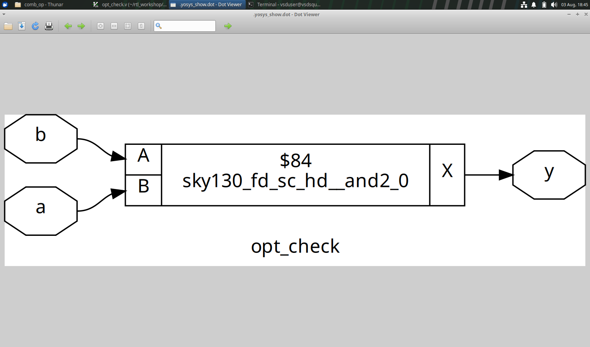
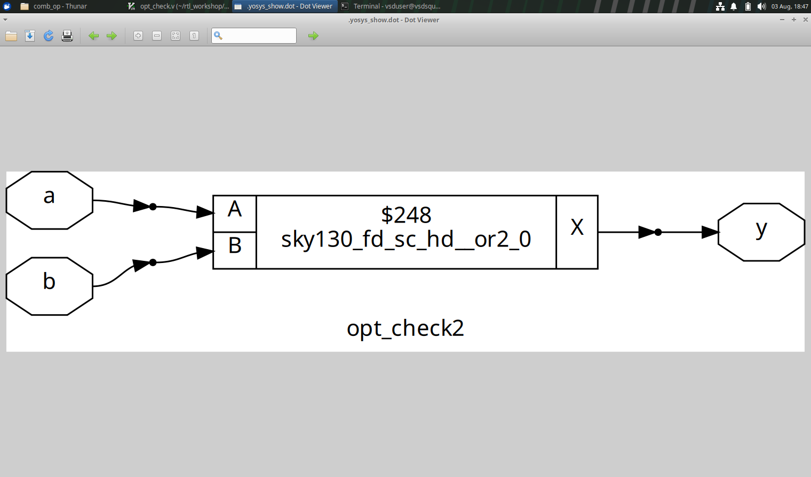
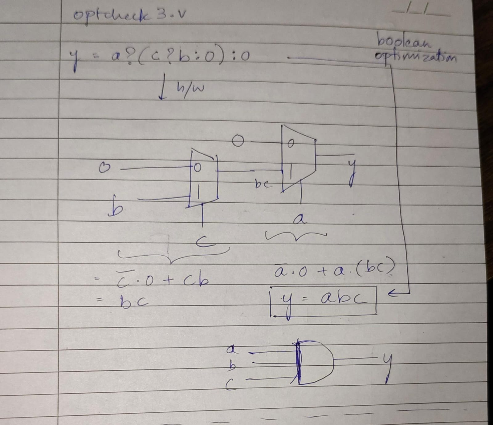
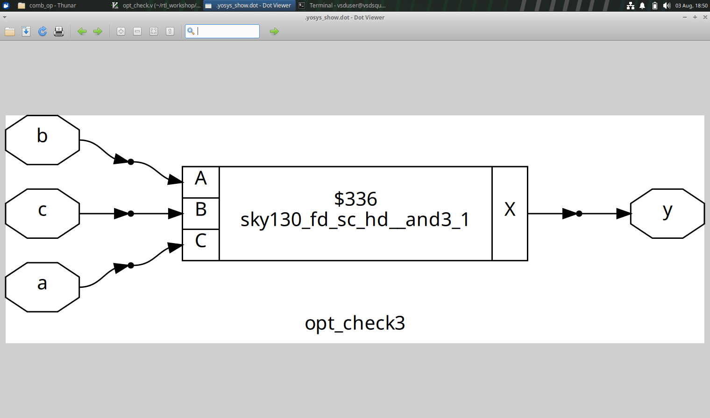
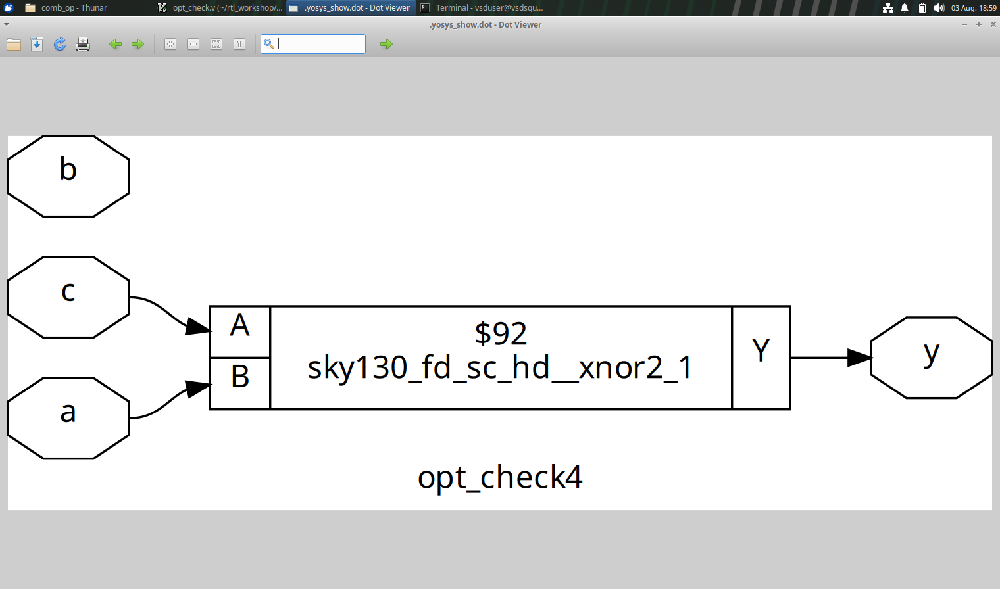

## Different combinational optimization techniques 

## EXAMPLE 1

The below code snippets are examples of constant propagation optimization technique. 

```
assign y = a?b:0;

assign y = a?1:b;
```


Expected circuits


actual circuit for optcheck.v


Actual circuit for optcheck2.v


## EXMAPLE 2

The below code snippet is an example of boolean optimization techniques.

```
assign y = a?(c?b:0):0;
```


Expected circuit for optcheck3.v


Actual circuit for optcheck3.v


## EXAMPLE 3

The below code snippet is an example of boolean optimization techniques.

```
 assign y = a?(b?(a & c ):c):(!c);
```


Expected circuit for optcheck4.v


Actual circuit for optcheck4.v

