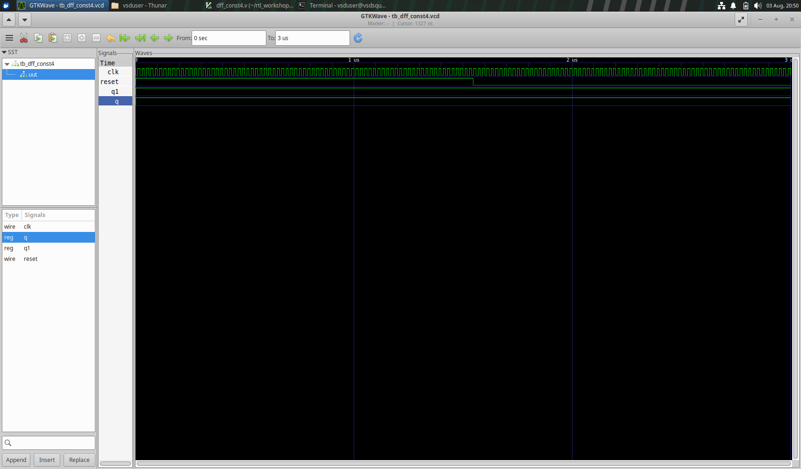

## VARIOUS INSTANCES OF SEQUENTIAL CONSTANT PROPAGATION

## EXAMPLE 1

CODE: 
```
always @(posedge clk, posedge reset)
begin
	if(reset)
		q <= 1'b0;
	else
		q <= 1'b1;
end
```

From simulation we can see that the output pin q is not always constant, hence this DFF must be retained, it can't act as a sequential constant.


Simulation


Expected circuit


Actual circuit


## EXAMPLE 2

Code 2, 3:
```
//code 2
always @(posedge clk, posedge reset)
begin
	if(reset)
		q <= 1'b1;
	else
		q <= 1'b1;
end

//code 3
always @(posedge clk, posedge reset)
begin
	if(reset)
	begin
		q <= 1'b1;
		q1 <= 1'b0;
	end
	else
	begin
		q1 <= 1'b1;
		q <= q1;
	end
end

```


Simulation of code 2 - the output q doesn't change, remains constant, so this DFF can be removed and it can act as a sequential constant.


Simulation of code 3 - the output q changes, so this DFF must be retained to maintain the functionality of the cirtuit.


Expected circuit for code 2 and 3 


Actual circuit of code 2


'abc' command error for code 2 shows that the circuit doesn't have any cells to map to.


Actual circuit for code 3


## EXAMPLE 3

Code 4, 5:
```
//code 4
always @(posedge clk, posedge reset)
begin
	if(reset)
	begin
		q <= 1'b1;
		q1 <= 1'b1;
	end
	else
	begin
		q1 <= 1'b1;
		q <= q1;
	end
end


//code 5
always @(posedge clk, posedge reset)
begin
	if(reset)
	begin
		q <= 1'b0;
		q1 <= 1'b0;
	end
	else
	begin
		q1 <= 1'b1;
		q <= q1;
	end
end

```


Simulation of code 4 - the output q doesn't change, remains constant, so this DFF can be removed and it can act as a sequential constant.


Simulation of code 5 - the output q changes, so this DFF must be retained to maintain the functionality of the cirtuit.


Expected circuit for code 4 and 5


Actual circuit of code 4


'abc' command error for code 4 shows that the circuit doesn't have any cells to map to.


Actual circuit for code 5


