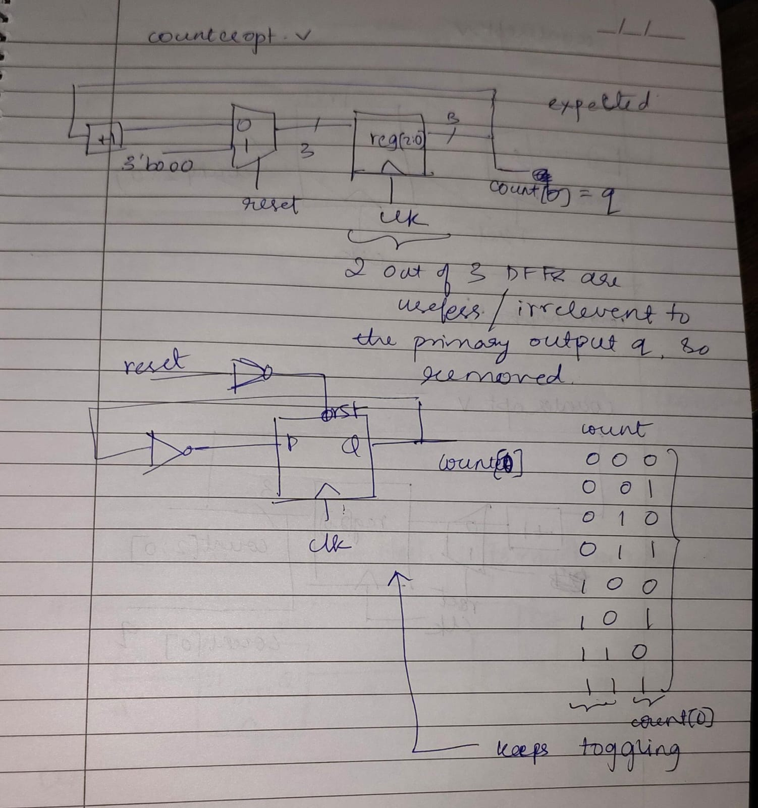
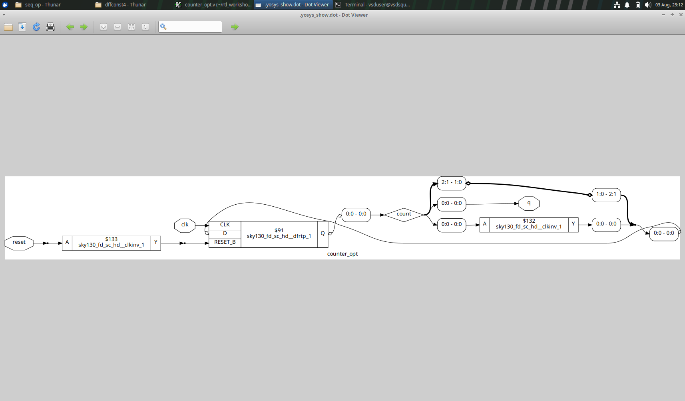
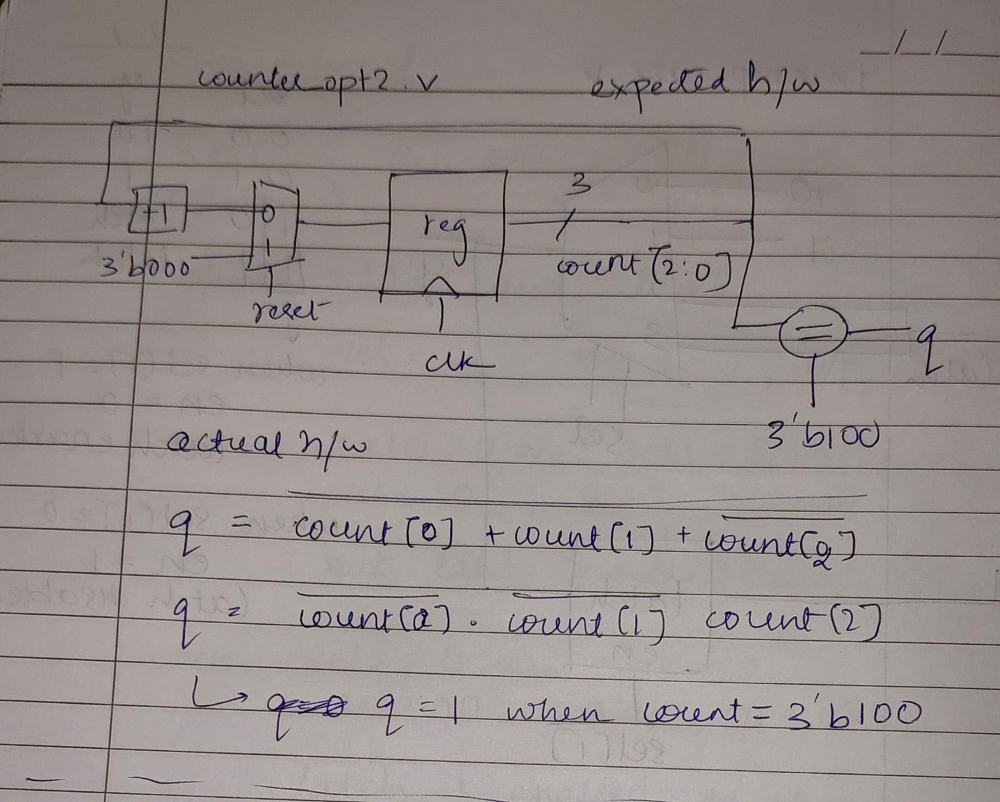
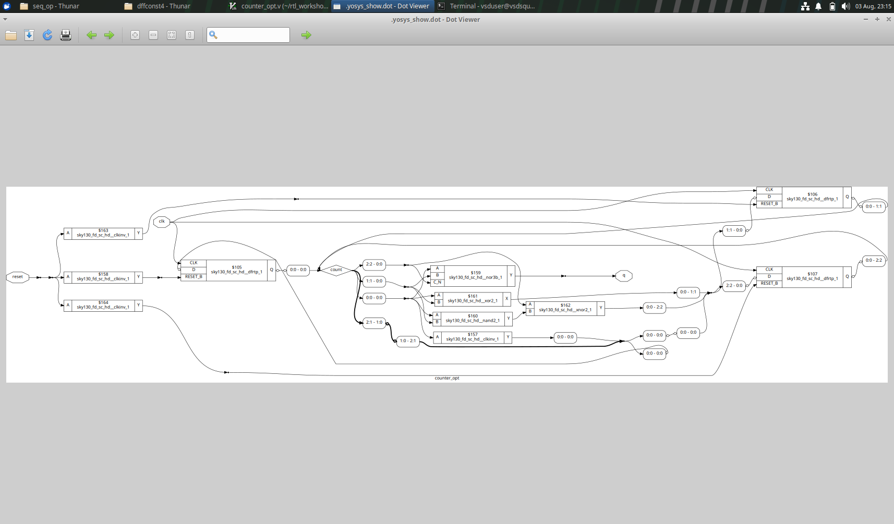

## Unused logic optimization

Logic, cells, wires, that are not related to the output at all are removed as a form of optimization.

The code below shows unused logic optimization in practice. The output is related to count[0] only, so other 2 DFFs are removed to optimize the circuit as shown below.

```
reg [2:0] count;
assign q = count[0];

always @(posedge clk ,posedge reset)
begin
	if(reset)
		count <= 3'b000;
	else
		count <= count + 1;
end
```


Expected circuit


Actual circuit


This code is different from the above one, in that all 3 bit of count are related to the output. So all three DFFs are retained unlike before.

```
reg [2:0] count;
assign q = (count[2:0] == 3'b100);

always @(posedge clk ,posedge reset)
begin
	if(reset)
		count <= 3'b000;
	else
		count <= count + 1;
end

```


Expected circuit


Actual circuit

