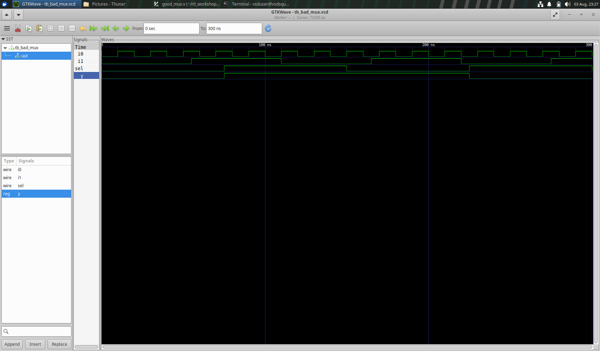
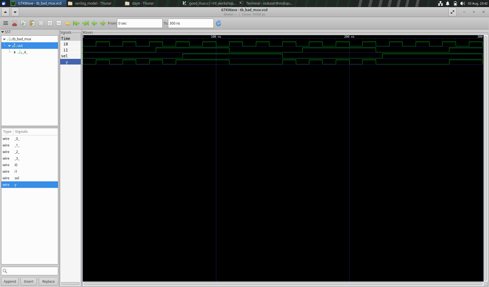

## Synthesis-simulation mismatch

The file bad_mux.v has the following code:

```
always @ (sel)
begin
	if(sel)
		y <= i1;
	else 
		y <= i0;
```

The simulator refers to the sensitivity list, and any changes in the inputs i0 and i1 are not propagated to the output. 
But the synthesis tool generates a mux, as expected, leading to a mismatch between them. 



RTL code simulation



Gate level simulation
