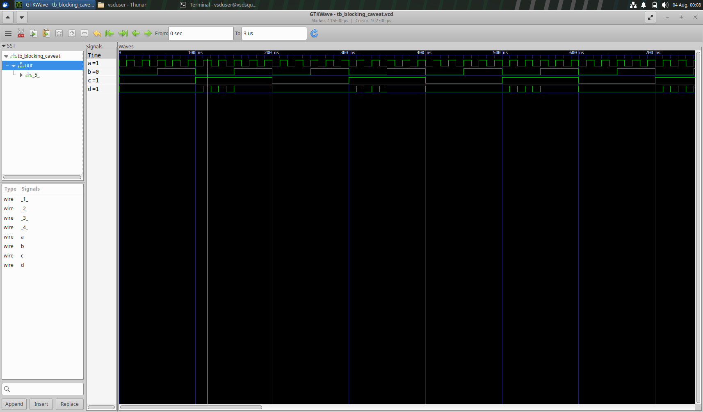

## Synthesis-simulation mismatch

```
always @ (*)
begin
	d = x & c;
	x = a | b;
end
```

In the code, due to blocking statements, signal x acts like a flop, as seen in the RTL simulation below:


According to the marker, it (a|b & c) = 1 since all inputs are 1, but the output d = 0 since it considers the previous value of x that is 0. This is because x is used before it is defined, and the blocking assigment happens sequentially, so intitially the current value of x is unknown, thus affecting the overall behaviour of this circuit.
But this doesn't happen in GLS, causing a mismatch.


