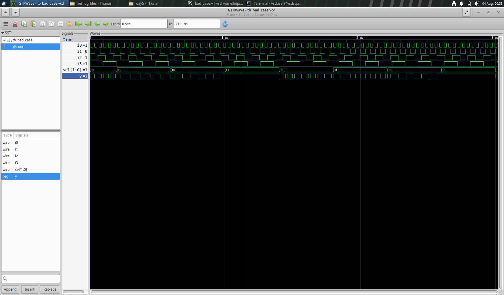
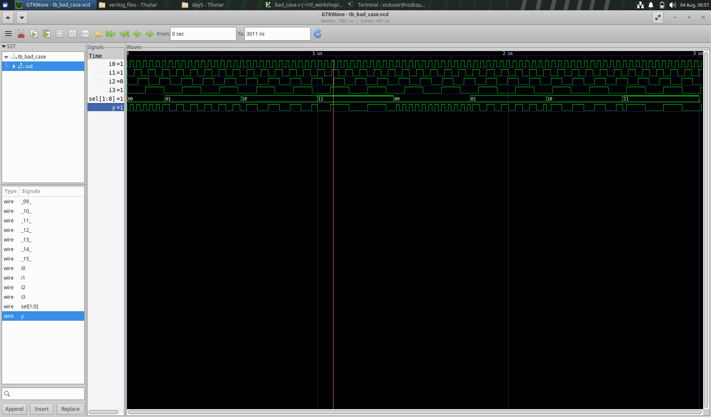

## Overlapping case definitions cause synthesis simulation mismatch

In the code below, for sel = 2'b11, both 2'b10 and 2'b1? match, due to which the simulator gets confused and for this case, the output is randomly given as 0 or 1. But the synthesis tool considers the latest assignment and output = i3. This causes a mismatch.

```
	case(sel)
		2'b00: y = i0;
		2'b01: y = i1;
		2'b10: y = i2;
		2'b1?: y = i3;
		//2'b11: y = i3;
	endcase
```



RTL simulation



GLS
