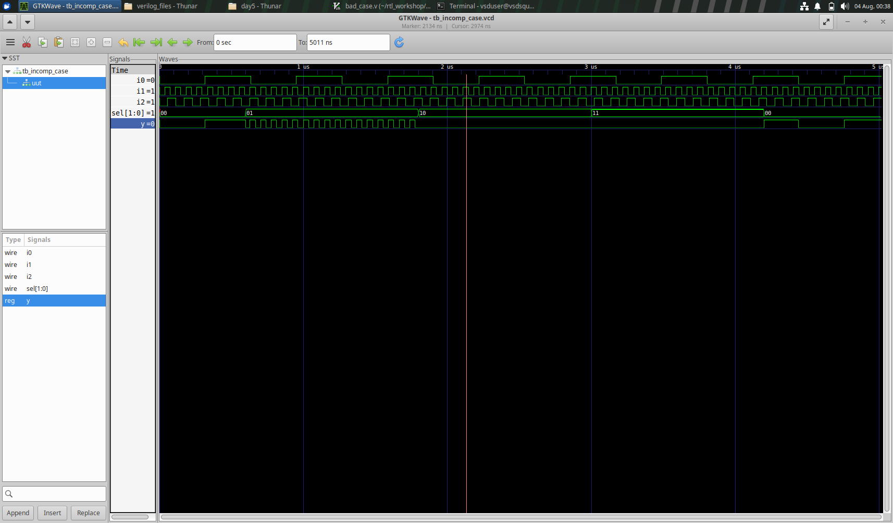
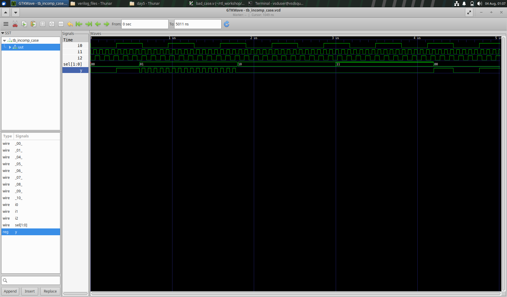
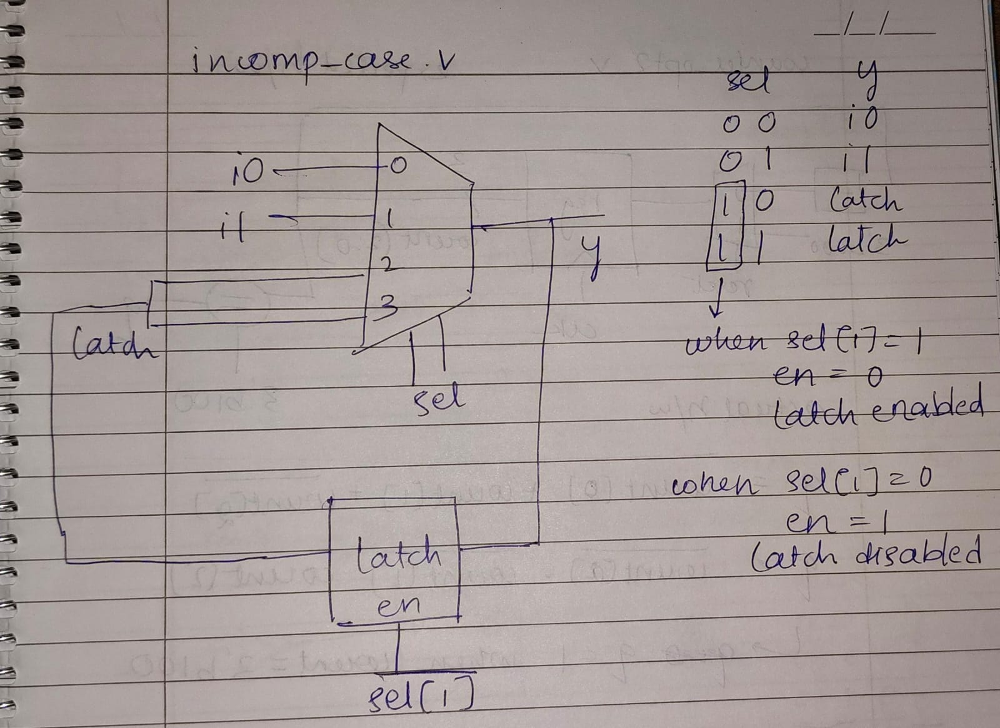
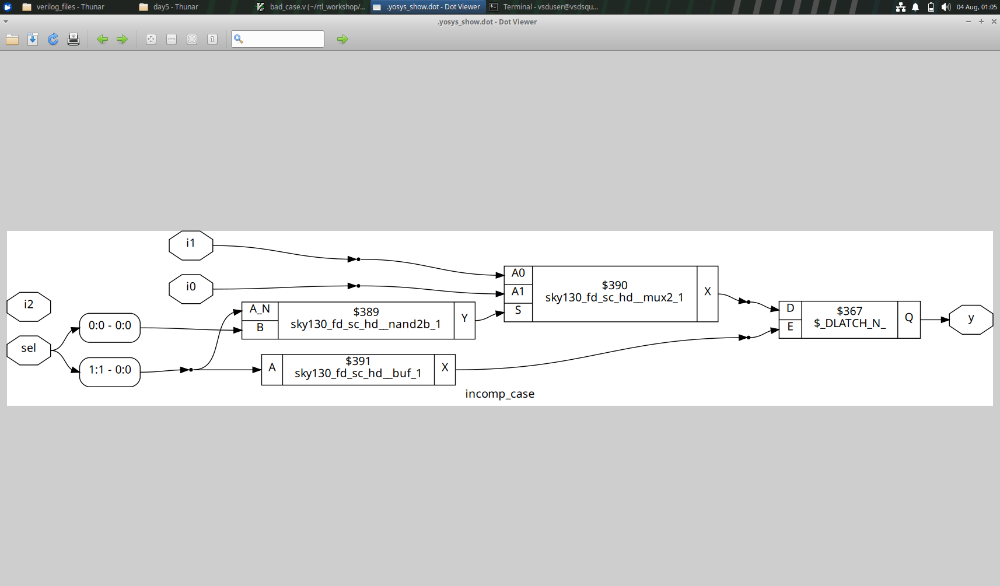

## Incomplete case consequences

Not listing all the possible cases of a case constant leads to inferred latch, with appropriate enable logic.
In the code below, 2'b10 and 2'b11 cases are not defined and there is not default statement, so the simulator and synthesis tool will infer a latch. In simulation it can be seen that when sel[1] is high, the output is a constant. And its seen in GLS too, so there's no synthesis-simulation mismatch. But due to bad coding, our design to code a combinational circuit has turned into a sequential circuit which is a blunder.

RTL simulation result

GLS result

Expected hardware

Actual synthesized circuit

In the synthesized circuit, an active low enable Dlatch is used, hence the enable condition is sel[1], unlike in predicted diagram. Also, a 2:1 mux is used, with select line s as nand(sel1', sel0) = sel1 + sel0'. 
When sel1 is 1, (for sel = 10 and 11) output is latched as en = 0.
When sel1 is 0, for sel = 00, s = 1, output is i1 and for sel = 01, s = 0, output = i0.

