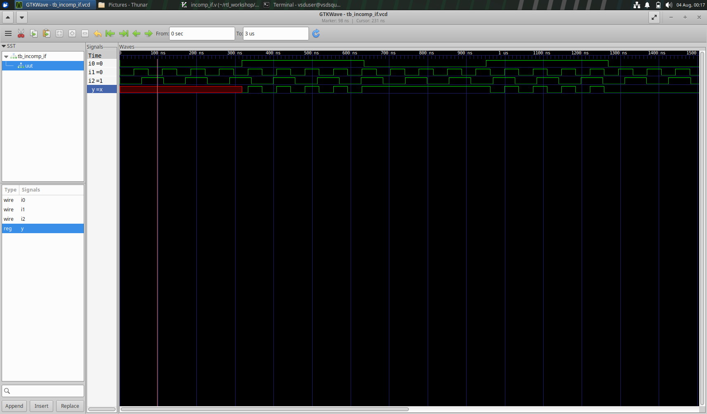
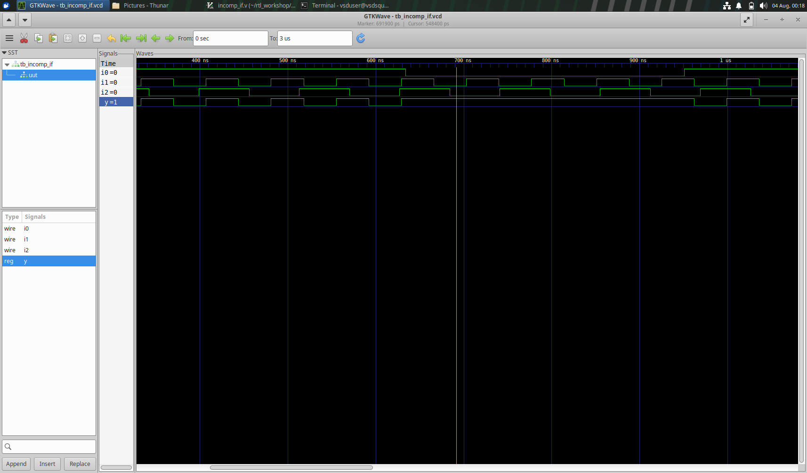
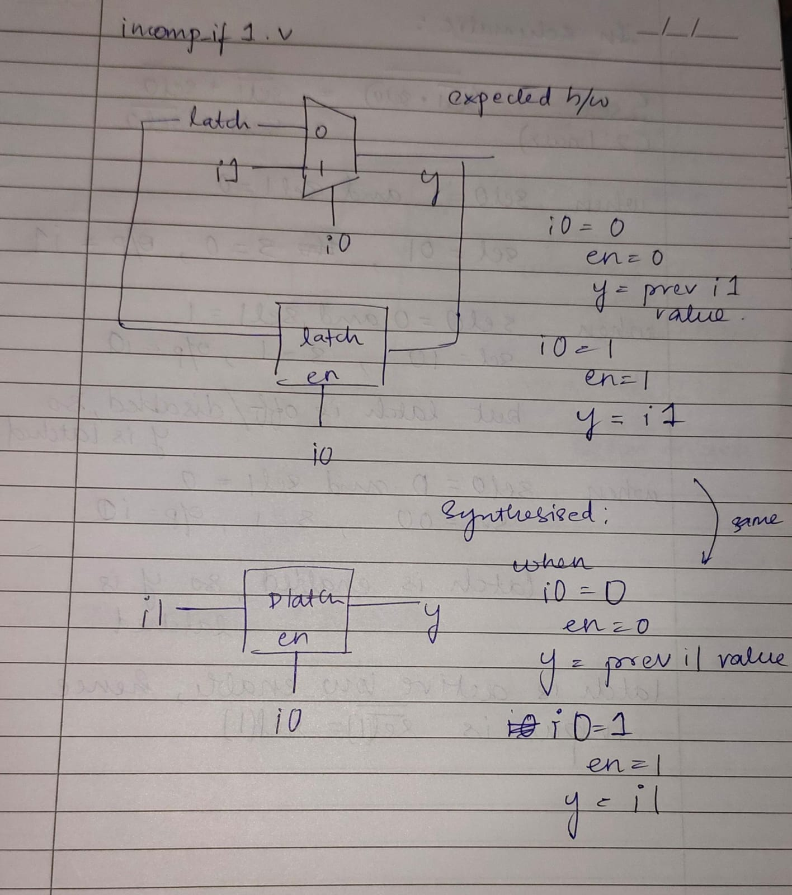
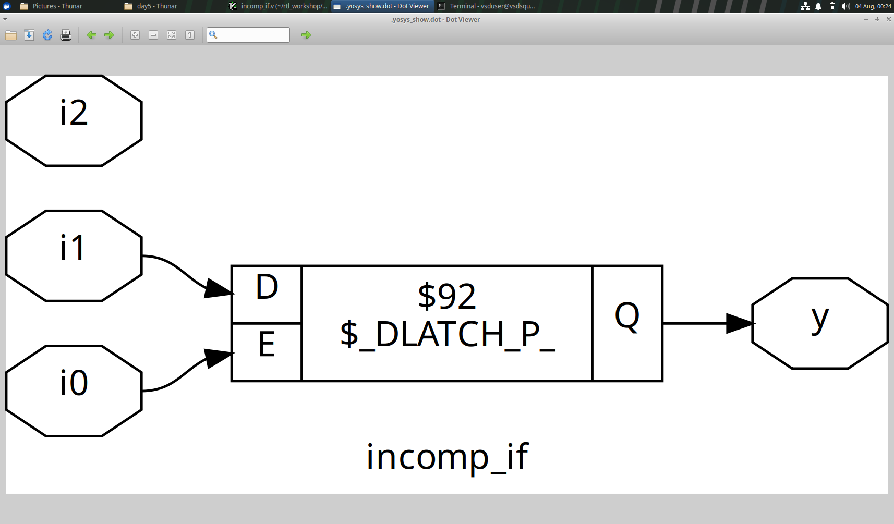
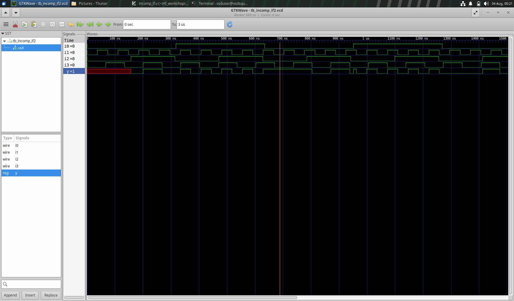
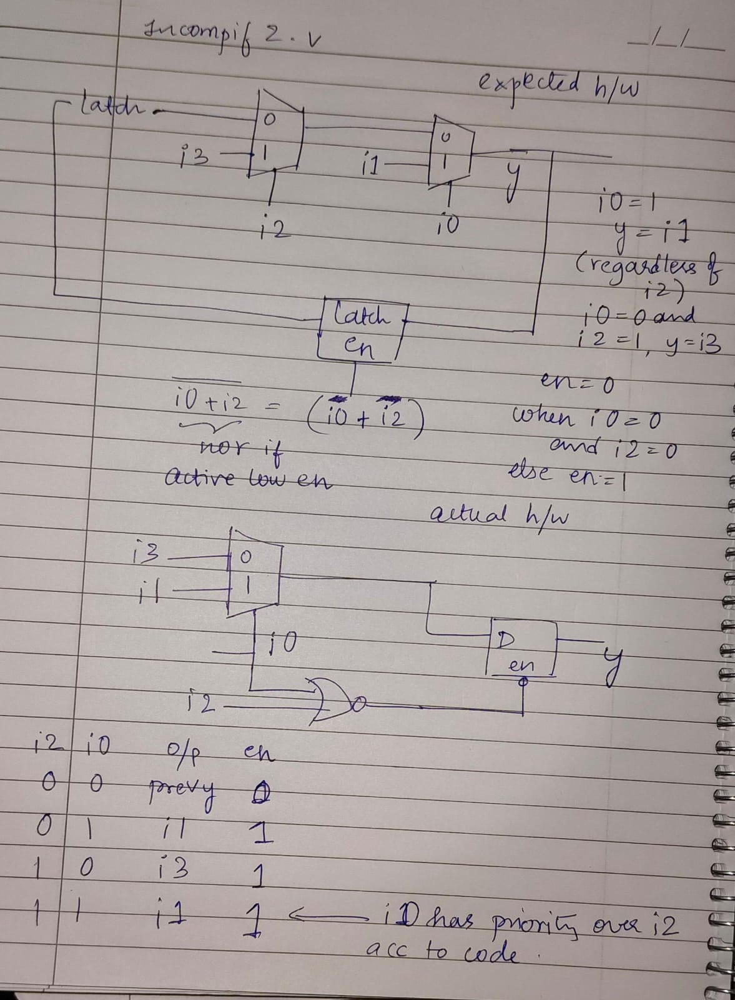
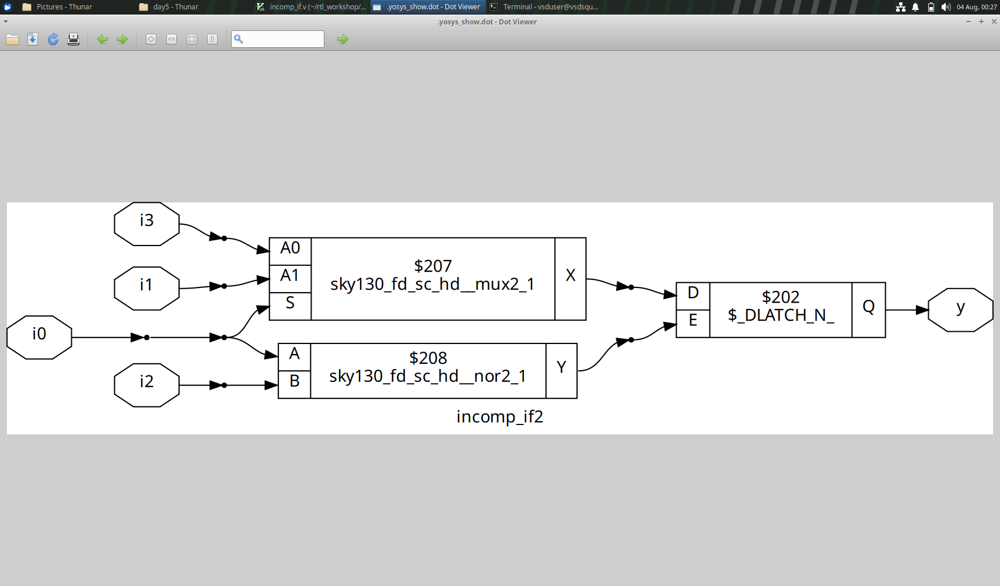

## Incomplete if consequences

## CASE 1

In the below code, else condition is not given, thus creating an inferred latch. 
```
	if(i0)
		y <= i1;
```

As seen in the simulation, initially, as long as i0 = 0, y is 'x' or since its previous state is unknown. Similarly, when initialised, and i0 becomes 0, y takes the value of i1 just before i0 became 0. 





Accordingly the expected and actual circuit:






## CASE 2

In the below code, else condition is not given, thus creating an inferred latch. 
```
	if(i0)
		y <= i1;
	else if (i2)
		y <= i3;
```

As seen in the simulation, initially, as long as i0 = 0 and i2 = 0, y is 'x' or since its previous state is unknown. Similarly, when initialised, and i0, i2 both become 0, y takes its value just before i0 and i2 both become 0. 




Accordingly the expected and actual circuit:




