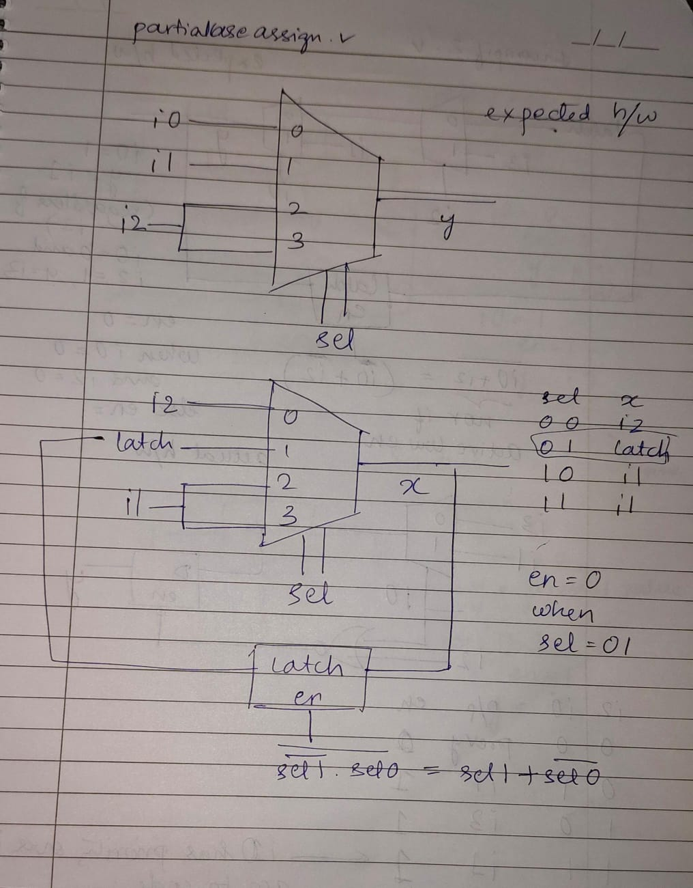
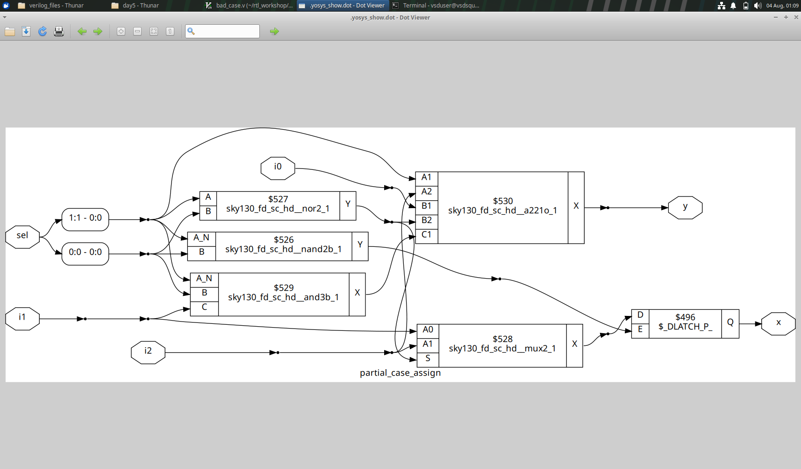
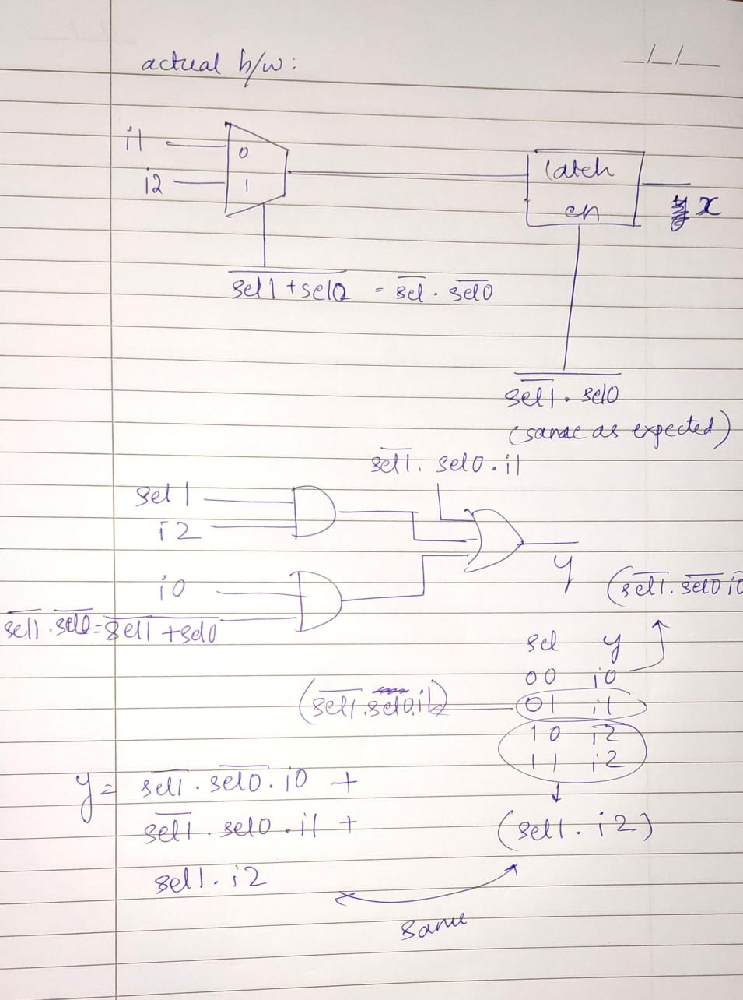

## Partial case assignment consequences

If all the outputs are not assigned a value in every case, as in the code below, it leads to an inferred latch even when a default statement is properly defined. 

```
	case(sel)
		2'b00 : begin
			y = i0;
			x = i2;
			end
		2'b01 : y = i1;
		default : begin
		           x = i1;
			   y = i2;
			  end
	endcase

```

y is synthesized into a proper mux but x is not. Synthesis-simulation mismatch is present.
The expected and actual circuits are as given below.







This shows how the expected circuit and actual circuit have the same function.
